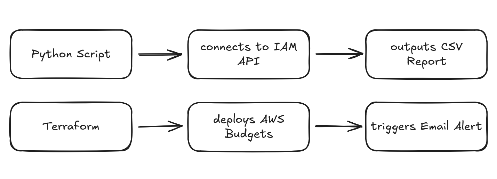

# AWS IAM Audit + Budget Control

## Problem

Companies face two big risks in AWS:

* **IAM sprawl** → inactive users, unused access keys, and over-permissive policies.
* **Unexpected costs** → sandbox/test projects left running without cost guardrails.

## Solution

This project provides a **lightweight governance toolkit** with:

* A **Python script** that audits IAM accounts and flags unused credentials.
* A **Terraform module** that deploys AWS Budgets with automated email alerts.

## Tools Used

* **AWS IAM** – User & key management.
* **AWS Budgets** – Cost monitoring and email alerts.
* **AWS CLI & boto3** – IAM API scripting.
* **Terraform** – Infrastructure as Code for budgets + guardrails.

## Features

* Generate CSV report of IAM users + last login date.
* Detect inactive access keys for cleanup.
* Automatic budget alerts (e.g., \$5 threshold).
* Modular Terraform config for easy reuse.

## Project Structure

```
aws-iam-audit-budget-control/
│── scripts/       # Python IAM audit script
│── infra/         # Terraform configs
│── docs/          # Architecture diagram + screenshots
│── README.md      # Project overview
```

## Architecture


